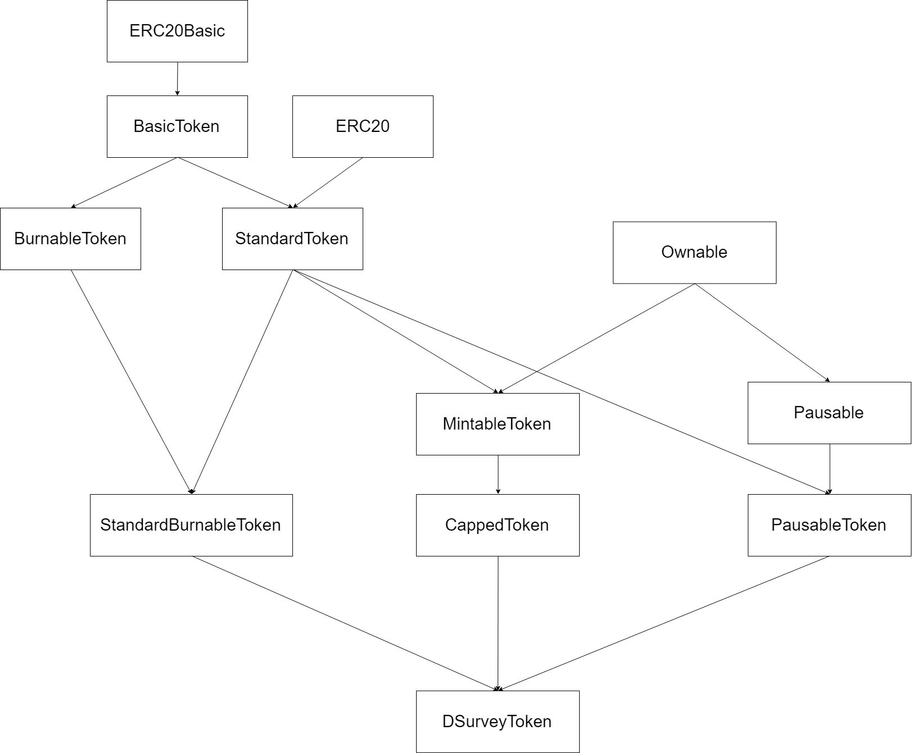
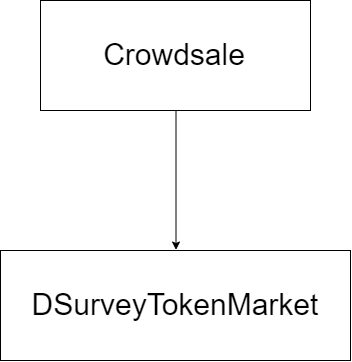
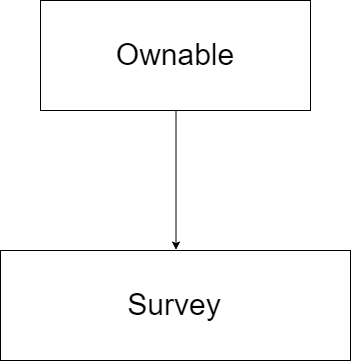
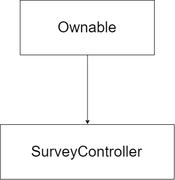

# dSurvey
Decentralized Survey Service

## Frontend 준비
### 소스 다운로드
```
git clone https://github.com/BC-Starter/dSurvey.git
```

### Truffle, Web3 설치
```
npm install -g truffle web3@0.20.7
```

### Frontend 패키지 설치
```
cd dSurvey
cd frontend
npm install
```

* ** truffle-hdwallet-provider 소스 수정 **
  * ethereumjs-wallet/hdkey를 사용하고 있는데, 0.6.1 버전으로 올라가면서 경로가 ethereumjs-wallet/dist/hdkey로 변경되었다.
  * 그래서 node_module/truffle-hdwallet-provider/index.js의 2번째 줄의 경로를 변경해 줘야 한다.

### 컨트랙트 컴파일
```
truffle compile
```

## 실행
### Frontend build
```
npm run build
```

## Backend 준비
### Backend 패키지 설치
```
cd ../backend
npm install
```

## 실행
### 파일 실행 권한 설정
```
cd bin
chmod 766 ./run-server.sh
```

### Run backend server
```
./run-server.sh
```

### forever (express 서버를 daemon으로 돌려 줌)
* 프로세스 리스트 확인

`./forever list`
* 프로세스 종료

`./forever stop [uid]`

## 컨트랙트 구조
### DSurveyToken
* ERC20 기반 토큰
* name : dSurveyToken
* symbol : DST
* decimals : 18
* total cap : 2 * 10^28
* initial cap : 1 * 10^28



### DsurveyTokenMarket
* 1 Wei = 1 DST로 구매할 수 있음



### Survey
* 공통
  * 설문지 내용 확인
  * 답변을 등록한 참여자 목록
  * 질문 당 참여자들이 등록한 답변 목록
* 설문 등록자
  * 질문과 선택지 추가
  * 설문 종료 후 나머지 토큰 회수
* 설문 참여자
  * 답변 등록
* 컨트랙트
  * 답변 등록에 대한 토큰 보상 전송



### SurveyController
* 공통
  * 설문 목록
  * 설문 카테고리 목록
  * 설문 상태 확인
* 설문 생성자
  * 설문 생성 (보상 토큰 할당, 미리 SurveyController에게 approve 해야 됨)
  * 설문 시작
  * 설문 종료
* 컨트랙트 소유자
  * 설문 카테고리 추가



## 시나리오
### 설문 생성
* **포인트 충전** : 설문 생성자가 DSurveyToken의 approve를 호출하여 SurveyController에게 토큰 전송 권한을 준다.
* **설문 컨트랙트 생성** : SurveyController의 createSurvey에 설문 카테고리, 설문 제목, 총 토큰 보상, 참여 당 토큰 보상을 넣어 새로운 설문을 생성한다. 이때 SurveyController가 새로 생성되는 Survey에게 설문 생성자의 토큰을 전송한다.
* **설문 내용 작성** : 생성 된 Survey의 addQuestionAndChoices를 호출하여 질문과 선택지를 입력한다. (질문 개수 만큼 반복)
* **설문 시작** : SurveyController의 startSurvey를 호출 해 Survey의 상태를 참여 가능한 상태로 변경한다.
### 설문 참여
* **참여 가능 설문 확인** : SurveyController의 getSurveyList를 호출하여 참여 가능한 설문을 확인한다.
* **설문 내용 확인** : 참여 가능한 설문을 선택하고 Survey의 getQuestionAndChoices를 호출하여 설문 내용을 확인한다.
* **답변 작성 및 토큰 보상** : Survey의 setAnswers을 호출하여 설문 답변을 등록한다. 작성을 완료하면 설문 생성자가 지정한 양의 토큰을 참여자에게 전송한다.
### 설문 종료
* **설문 상태 변경** : 모든 설문이 완료되면 SurveyController의 completeSurvey를 호출하여 설문을 참여할 수 없는 상태로 변경한다.
* **토큰 잔액 반환** : Survey의 withdraw를 호출하면 참여자에게 지급되고 남은 보상 토큰이 설문 생성자에게로 반환된다.
### 설문 결과 판매
* **설문 결과 판매 등록** : 완료 된 설문에 한해서 설문의 상태를 판매로 변경하여 설문 결과를 필요로 하는 사람들이 구매할 수 있게 한다.
* **판매 설문 목록** : 판매 중인 설문들의 *설문 제목*, *설문 내용*, *참여자 수*, *판매 금액*을 확인할 수 있다.
* **설문 결과 구매** : 마음에 드는 설문을 구매하면 해당 설문의 결과 값을 확인할 수 있다.
### 내 설문 관리
* **생성 설문 목록** : 내가 생성한 설문들의 목록을 확인할 수 있다.
* **참여 설문 목록** : 내가 참여한 설문들의 목록을 확인할 수 있다.
* **구매 설문 목록** : 내가 구매한 설문들의 목록을 확인할 수 있다.
